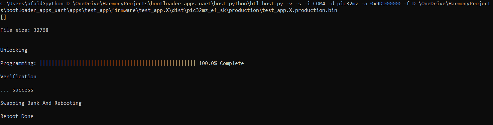
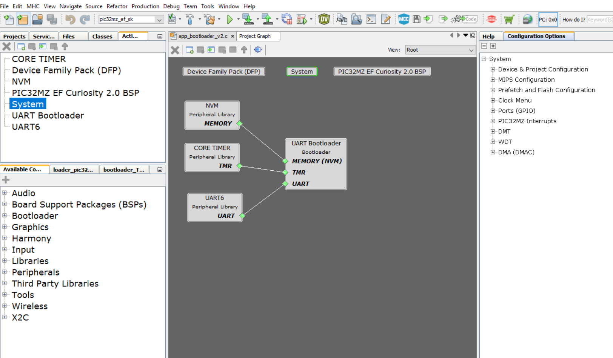

# bootloader_apps_uart

Environment:
1. MPLABX IDE V6, Harmony V3
2. XC32 V2.4
   1. Python v3.7 install pyserial package
3. UART Bootloader
4. Upload command: 
        python <PATH>\bootloader_apps_uart\host_python\btl_host.py -v -s -i COM4 -d pic32mz -a 0x9D100000 -f <PATH>\bootloader_apps_uart\apps\test_app\firmware\test_app.X\dist\pic32mz_ef_sk\production\test_app.X.production.bin
5. Use PIC32MZ Curiosity V2 Board

Example,

Harmony 3 Architecture

